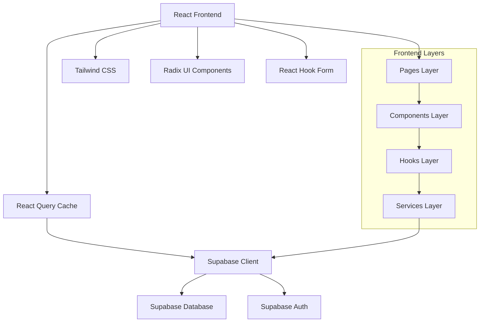

# Documento de Design - Modernização da Aplicação Financeira

## Visão Geral

Este documento define a arquitetura técnica e o design para modernizar a aplicação financeira Finanças+. O projeto transformará a aplicação atual em uma solução moderna, responsiva e acessível, migrando completamente de dados mockados para persistência real no Supabase.

## Arquitetura

### Arquitetura Geral



### Stack Tecnológico

**Frontend:**
- React 18 com TypeScript
- Vite para build e desenvolvimento
- Tailwind CSS para estilização
- Radix UI para componentes acessíveis
- React Query para gerenciamento de estado servidor
- React Hook Form para formulários
- Recharts para visualizações
- React Router para navegação

**Backend:**
- Supabase (PostgreSQL + Auth + Real-time)
- Row Level Security (RLS) para segurança

**Ferramentas:**
- ESLint para linting
- TypeScript para tipagem
- Date-fns para manipulação de datas

## Componentes e Interfaces

### Estrutura de Componentes

```
src/
├── components/
│   ├── ui/                    # Componentes base (Radix UI)
│   ├── layout/               # Componentes de layout
│   │   ├── Sidebar.tsx
│   │   ├── Header.tsx
│   │   ├── MobileNav.tsx
│   │   └── Layout.tsx
│   ├── dashboard/            # Componentes específicos do dashboard
│   │   ├── StatCard.tsx
│   │   ├── ChartCard.tsx
│   │   ├── BudgetProgress.tsx
│   │   └── RecentTransactions.tsx
│   ├── transactions/         # Componentes de transações
│   │   ├── TransactionForm.tsx
│   │   ├── TransactionList.tsx
│   │   ├── TransactionFilters.tsx
│   │   └── TransactionCard.tsx
│   ├── budgets/             # Componentes de orçamentos
│   │   ├── BudgetForm.tsx
│   │   ├── BudgetCard.tsx
│   │   └── BudgetProgress.tsx
│   ├── categories/          # Componentes de categorias
│   │   ├── CategoryForm.tsx
│   │   ├── CategoryList.tsx
│   │   └── CategoryPicker.tsx
│   ├── reports/             # Componentes de relatórios
│   │   ├── ReportFilters.tsx
│   │   ├── ExpenseChart.tsx
│   │   └── IncomeChart.tsx
│   └── common/              # Componentes comuns
│       ├── LoadingSpinner.tsx
│       ├── ErrorBoundary.tsx
│       ├── ConfirmDialog.tsx
│       └── EmptyState.tsx
```

### Design System

**Cores Principais:**
```css
:root {
  /* Primary Colors */
  --primary-50: #eff6ff;
  --primary-500: #3b82f6;
  --primary-600: #2563eb;
  --primary-700: #1d4ed8;
  
  /* Success Colors */
  --success-50: #f0fdf4;
  --success-500: #22c55e;
  --success-600: #16a34a;
  
  /* Warning Colors */
  --warning-50: #fffbeb;
  --warning-500: #f59e0b;
  --warning-600: #d97706;
  
  /* Error Colors */
  --error-50: #fef2f2;
  --error-500: #ef4444;
  --error-600: #dc2626;
  
  /* Neutral Colors */
  --gray-50: #f9fafb;
  --gray-100: #f3f4f6;
  --gray-200: #e5e7eb;
  --gray-500: #6b7280;
  --gray-700: #374151;
  --gray-900: #111827;
}
```

**Tipografia:**
```css
/* Headings */
.text-h1 { @apply text-3xl font-bold tracking-tight; }
.text-h2 { @apply text-2xl font-semibold tracking-tight; }
.text-h3 { @apply text-xl font-semibold; }
.text-h4 { @apply text-lg font-medium; }

/* Body */
.text-body-lg { @apply text-base leading-relaxed; }
.text-body { @apply text-sm leading-normal; }
.text-body-sm { @apply text-xs leading-normal; }

/* Labels */
.text-label { @apply text-sm font-medium; }
.text-label-sm { @apply text-xs font-medium; }
```

**Espaçamentos:**
```css
/* Spacing Scale */
.space-xs { @apply p-2; }
.space-sm { @apply p-4; }
.space-md { @apply p-6; }
.space-lg { @apply p-8; }
.space-xl { @apply p-12; }
```

### Responsividade

**Breakpoints:**
```css
/* Mobile First Approach */
sm: '640px',   /* Tablet portrait */
md: '768px',   /* Tablet landscape */
lg: '1024px',  /* Desktop */
xl: '1280px',  /* Large desktop */
2xl: '1536px'  /* Extra large desktop */
```

**Layout Responsivo:**
- **Mobile (< 768px):** Layout em coluna única, sidebar colapsável, navegação bottom sheet
- **Tablet (768px - 1024px):** Layout híbrido, sidebar overlay, componentes em grid 2x2
- **Desktop (> 1024px):** Layout completo com sidebar fixa, grid completo

### Acessibilidade

**Implementações WCAG 2.1:**

1. **Navegação por Teclado:**
   - Focus management com `focus-visible`
   - Skip links para navegação rápida
   - Trap focus em modais e dropdowns

2. **Screen Readers:**
   - Semantic HTML (nav, main, section, article)
   - ARIA labels e descriptions
   - Live regions para atualizações dinâmicas

3. **Contraste e Cores:**
   - Contraste mínimo 4.5:1 para texto normal
   - Contraste mínimo 3:1 para texto grande
   - Indicadores não dependentes apenas de cor

4. **Formulários:**
   - Labels associados corretamente
   - Mensagens de erro descritivas
   - Instruções claras e acessíveis

## Modelos de Dados

### Estrutura do Banco de Dados

```sql
-- Profiles (extends Supabase auth.users)
CREATE TABLE profiles (
  id UUID REFERENCES auth.users PRIMARY KEY,
  first_name TEXT,
  last_name TEXT,
  email TEXT,
  current_organization_id UUID,
  preferences JSONB DEFAULT '{}',
  created_at TIMESTAMPTZ DEFAULT NOW(),
  updated_at TIMESTAMPTZ DEFAULT NOW()
);

-- Categories
CREATE TABLE categories (
  id UUID DEFAULT gen_random_uuid() PRIMARY KEY,
  user_id UUID REFERENCES auth.users NOT NULL,
  name TEXT NOT NULL,
  type TEXT NOT NULL CHECK (type IN ('income', 'expense')),
  color TEXT NOT NULL DEFAULT '#64748b',
  icon TEXT,
  is_active BOOLEAN DEFAULT true,
  created_at TIMESTAMPTZ DEFAULT NOW(),
  updated_at TIMESTAMPTZ DEFAULT NOW()
);

-- Transactions
CREATE TABLE transactions (
  id UUID DEFAULT gen_random_uuid() PRIMARY KEY,
  user_id UUID REFERENCES auth.users NOT NULL,
  category_id UUID REFERENCES categories,
  description TEXT NOT NULL,
  amount DECIMAL(12,2) NOT NULL,
  date DATE NOT NULL,
  type TEXT NOT NULL CHECK (type IN ('income', 'expense')),
  payment_method TEXT NOT NULL,
  installments INTEGER DEFAULT 1,
  installment_number INTEGER DEFAULT 1,
  parent_transaction_id UUID REFERENCES transactions,
  is_recurring BOOLEAN DEFAULT false,
  recurrence_rule JSONB,
  observations TEXT,
  tags TEXT[],
  created_at TIMESTAMPTZ DEFAULT NOW(),
  updated_at TIMESTAMPTZ DEFAULT NOW()
);

-- Budgets
CREATE TABLE budgets (
  id UUID DEFAULT gen_random_uuid() PRIMARY KEY,
  user_id UUID REFERENCES auth.users NOT NULL,
  category_id UUID REFERENCES categories,
  name TEXT NOT NULL,
  planned_amount DECIMAL(12,2) NOT NULL,
  spent_amount DECIMAL(12,2) DEFAULT 0,
  period_type TEXT NOT NULL DEFAULT 'monthly' CHECK (period_type IN ('weekly', 'monthly', 'yearly')),
  period_start DATE NOT NULL,
  period_end DATE NOT NULL,
  alert_percentage INTEGER DEFAULT 80,
  is_active BOOLEAN DEFAULT true,
  created_at TIMESTAMPTZ DEFAULT NOW(),
  updated_at TIMESTAMPTZ DEFAULT NOW()
);

-- User Settings
CREATE TABLE user_settings (
  id UUID DEFAULT gen_random_uuid() PRIMARY KEY,
  user_id UUID REFERENCES auth.users UNIQUE NOT NULL,
  currency TEXT DEFAULT 'BRL',
  language TEXT DEFAULT 'pt-BR',
  theme TEXT DEFAULT 'light' CHECK (theme IN ('light', 'dark', 'system')),
  notifications JSONB DEFAULT '{"email": true, "push": true, "budget_alerts": true}',
  date_format TEXT DEFAULT 'DD/MM/YYYY',
  number_format TEXT DEFAULT 'pt-BR',
  created_at TIMESTAMPTZ DEFAULT NOW(),
  updated_at TIMESTAMPTZ DEFAULT NOW()
);
```

### Tipos TypeScript

```typescript
// Core Types
export interface User {
  id: string;
  email: string;
  first_name?: string;
  last_name?: string;
  preferences?: UserPreferences;
}

export interface UserPreferences {
  currency: string;
  language: string;
  theme: 'light' | 'dark' | 'system';
  notifications: NotificationSettings;
  dateFormat: string;
  numberFormat: string;
}

export interface NotificationSettings {
  email: boolean;
  push: boolean;
  budgetAlerts: boolean;
}

export interface Category {
  id: string;
  user_id: string;
  name: string;
  type: 'income' | 'expense';
  color: string;
  icon?: string;
  is_active: boolean;
  created_at: string;
  updated_at: string;
}

export interface Transaction {
  id: string;
  user_id: string;
  category_id?: string;
  category?: Category;
  description: string;
  amount: number;
  date: string;
  type: 'income' | 'expense';
  payment_method: string;
  installments?: number;
  installment_number?: number;
  parent_transaction_id?: string;
  is_recurring?: boolean;
  recurrence_rule?: RecurrenceRule;
  observations?: string;
  tags?: string[];
  created_at: string;
  updated_at: string;
}

export interface Budget {
  id: string;
  user_id: string;
  category_id?: string;
  category?: Category;
  name: string;
  planned_amount: number;
  spent_amount: number;
  period_type: 'weekly' | 'monthly' | 'yearly';
  period_start: string;
  period_end: string;
  alert_percentage: number;
  is_active: boolean;
  created_at: string;
  updated_at: string;
}

export interface RecurrenceRule {
  frequency: 'daily' | 'weekly' | 'monthly' | 'yearly';
  interval: number;
  end_date?: string;
  count?: number;
}

// API Response Types
export interface ApiResponse<T> {
  data: T;
  error?: string;
  message?: string;
}

export interface PaginatedResponse<T> {
  data: T[];
  count: number;
  page: number;
  limit: number;
  total_pages: number;
}

// Chart Data Types
export interface ChartData {
  name: string;
  value: number;
  color?: string;
}

export interface MonthlyData {
  month: string;
  income: number;
  expenses: number;
  balance: number;
}

export interface CategoryExpense {
  category: string;
  amount: number;
  percentage: number;
  color: string;
}
```

## Tratamento de Erros

### Estratégia de Error Handling

```typescript
// Error Types
export class AppError extends Error {
  constructor(
    message: string,
    public code: string,
    public statusCode: number = 500
  ) {
    super(message);
    this.name = 'AppError';
  }
}

export class ValidationError extends AppError {
  constructor(message: string, public field?: string) {
    super(message, 'VALIDATION_ERROR', 400);
    this.name = 'ValidationError';
  }
}

export class NetworkError extends AppError {
  constructor(message: string = 'Erro de conexão') {
    super(message, 'NETWORK_ERROR', 0);
    this.name = 'NetworkError';
  }
}

// Error Boundary Component
export class ErrorBoundary extends Component<
  { children: ReactNode; fallback?: ComponentType<{ error: Error }> },
  { hasError: boolean; error?: Error }
> {
  constructor(props: any) {
    super(props);
    this.state = { hasError: false };
  }

  static getDerivedStateFromError(error: Error) {
    return { hasError: true, error };
  }

  componentDidCatch(error: Error, errorInfo: ErrorInfo) {
    console.error('Error caught by boundary:', error, errorInfo);
    // Log to error reporting service
  }

  render() {
    if (this.state.hasError) {
      const FallbackComponent = this.props.fallback || DefaultErrorFallback;
      return <FallbackComponent error={this.state.error!} />;
    }

    return this.props.children;
  }
}

// Global Error Handler
export const handleApiError = (error: any): AppError => {
  if (error.code === 'PGRST116') {
    return new ValidationError('Dados inválidos fornecidos');
  }
  
  if (error.message?.includes('JWT')) {
    return new AppError('Sessão expirada', 'AUTH_ERROR', 401);
  }
  
  if (!navigator.onLine) {
    return new NetworkError('Sem conexão com a internet');
  }
  
  return new AppError(
    error.message || 'Erro interno do servidor',
    'UNKNOWN_ERROR'
  );
};
```

## Estratégia de Testes

### Estrutura de Testes

```
src/
├── __tests__/
│   ├── components/
│   │   ├── dashboard/
│   │   ├── transactions/
│   │   └── budgets/
│   ├── hooks/
│   ├── services/
│   └── utils/
├── __mocks__/
│   ├── supabase.ts
│   └── react-query.ts
└── test-utils/
    ├── setup.ts
    ├── render.tsx
    └── factories.ts
```

### Tipos de Testes

1. **Unit Tests:** Componentes individuais, hooks, utilitários
2. **Integration Tests:** Fluxos completos de funcionalidades
3. **E2E Tests:** Jornadas críticas do usuário
4. **Accessibility Tests:** Conformidade WCAG

### Ferramentas de Teste

- **Jest:** Framework de testes
- **React Testing Library:** Testes de componentes
- **MSW:** Mock Service Worker para APIs
- **Playwright:** Testes E2E
- **axe-core:** Testes de acessibilidade

## Performance e Otimização

### Estratégias de Performance

1. **Code Splitting:**
   ```typescript
   // Lazy loading de páginas
   const Dashboard = lazy(() => import('@/pages/Dashboard'));
   const Transactions = lazy(() => import('@/pages/Transactions'));
   ```

2. **Memoização:**
   ```typescript
   // Componentes pesados
   const ExpensiveChart = memo(({ data }: { data: ChartData[] }) => {
     const processedData = useMemo(() => 
       processChartData(data), [data]
     );
     
     return <Chart data={processedData} />;
   });
   ```

3. **Virtual Scrolling:**
   ```typescript
   // Para listas grandes de transações
   import { FixedSizeList as List } from 'react-window';
   ```

4. **React Query Optimizations:**
   ```typescript
   // Cache inteligente e background updates
   const queryClient = new QueryClient({
     defaultOptions: {
       queries: {
         staleTime: 5 * 60 * 1000, // 5 minutes
         cacheTime: 10 * 60 * 1000, // 10 minutes
         refetchOnWindowFocus: false,
         retry: (failureCount, error) => {
           if (error.status === 404) return false;
           return failureCount < 3;
         },
       },
     },
   });
   ```

### Métricas de Performance

- **First Contentful Paint (FCP):** < 1.5s
- **Largest Contentful Paint (LCP):** < 2.5s
- **Cumulative Layout Shift (CLS):** < 0.1
- **First Input Delay (FID):** < 100ms

## Segurança

### Row Level Security (RLS)

```sql
-- Policies para transactions
CREATE POLICY "Users can view own transactions" ON transactions
  FOR SELECT USING (auth.uid() = user_id);

CREATE POLICY "Users can insert own transactions" ON transactions
  FOR INSERT WITH CHECK (auth.uid() = user_id);

CREATE POLICY "Users can update own transactions" ON transactions
  FOR UPDATE USING (auth.uid() = user_id);

CREATE POLICY "Users can delete own transactions" ON transactions
  FOR DELETE USING (auth.uid() = user_id);
```

### Validação de Dados

```typescript
// Schemas de validação com Zod
export const transactionSchema = z.object({
  description: z.string().min(1, 'Descrição é obrigatória').max(255),
  amount: z.number().positive('Valor deve ser positivo'),
  date: z.string().regex(/^\d{4}-\d{2}-\d{2}$/, 'Data inválida'),
  type: z.enum(['income', 'expense']),
  payment_method: z.string().min(1, 'Método de pagamento é obrigatório'),
  category_id: z.string().uuid().optional(),
});

export const budgetSchema = z.object({
  name: z.string().min(1, 'Nome é obrigatório').max(100),
  planned_amount: z.number().positive('Valor planejado deve ser positivo'),
  alert_percentage: z.number().min(1).max(100),
  category_id: z.string().uuid().optional(),
});
```

## Migração de Dados

### Estratégia de Migração

1. **Fase 1:** Manter dados mockados como fallback
2. **Fase 2:** Implementar APIs reais em paralelo
3. **Fase 3:** Migrar componente por componente
4. **Fase 4:** Remover dados mockados completamente

### Scripts de Migração

```typescript
// Migração de categorias padrão
export const seedDefaultCategories = async (userId: string) => {
  const defaultCategories = [
    { name: 'Alimentação', type: 'expense', color: '#ef4444' },
    { name: 'Transporte', type: 'expense', color: '#f97316' },
    { name: 'Moradia', type: 'expense', color: '#eab308' },
    { name: 'Salário', type: 'income', color: '#22c55e' },
  ];

  const { error } = await supabase
    .from('categories')
    .insert(
      defaultCategories.map(cat => ({ ...cat, user_id: userId }))
    );

  if (error) throw error;
};
```

## Deployment e DevOps

### Build e Deploy

```yaml
# GitHub Actions workflow
name: Deploy to Production
on:
  push:
    branches: [main]

jobs:
  build-and-deploy:
    runs-on: ubuntu-latest
    steps:
      - uses: actions/checkout@v3
      - uses: actions/setup-node@v3
        with:
          node-version: '18'
          cache: 'npm'
      
      - run: npm ci
      - run: npm run lint
      - run: npm run test
      - run: npm run build
      
      - name: Deploy to Vercel
        uses: vercel/action@v1
        with:
          vercel-token: ${{ secrets.VERCEL_TOKEN }}
```

### Monitoramento

- **Error Tracking:** Sentry para captura de erros
- **Analytics:** Google Analytics para métricas de uso
- **Performance:** Web Vitals para métricas de performance
- **Uptime:** Pingdom para monitoramento de disponibilidade