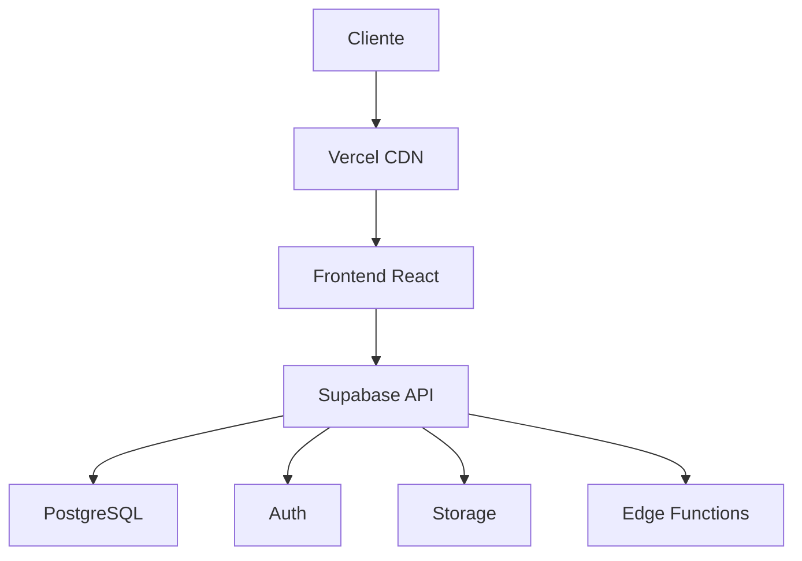

# Configuração de Infraestrutura - Finanças+

Este documento descreve a configuração de infraestrutura necessária para executar o Finanças+ em ambientes de desenvolvimento, staging e produção.

## Visão Geral da Arquitetura

O Finanças+ utiliza uma arquitetura moderna baseada em:

- **Frontend**: React com TypeScript, hospedado na Vercel
- **Backend**: Supabase (PostgreSQL + Auth + Storage + Functions)
- **CI/CD**: GitHub Actions para integração e entrega contínua



## Requisitos de Infraestrutura

### Supabase

1. **Criar um projeto no Supabase**:
   - Acesse [supabase.com](https://supabase.com) e crie uma conta
   - Crie um novo projeto
   - Anote a URL e a chave anônima do projeto

2. **Configurar o banco de dados**:
   - Execute as migrações SQL localizadas em `supabase/migrations/`
   - Configure as políticas de Row Level Security (RLS)

3. **Configurar autenticação**:
   - Habilite os provedores de autenticação desejados (email/senha, Google, etc.)
   - Configure os redirecionamentos de URL

### Vercel

1. **Criar um projeto na Vercel**:
   - Acesse [vercel.com](https://vercel.com) e crie uma conta
   - Importe o repositório do GitHub
   - Configure as variáveis de ambiente:
     - `VITE_SUPABASE_URL`: URL do seu projeto Supabase
     - `VITE_SUPABASE_ANON_KEY`: Chave anônima do seu projeto Supabase

2. **Configurar domínios**:
   - Adicione seus domínios personalizados
   - Configure certificados SSL

3. **Configurar ambientes**:
   - Production: Conectado à branch `main`
   - Staging: Conectado à branch `develop`
   - Preview: Conectado a Pull Requests

### GitHub Actions

O pipeline de CI/CD já está configurado no arquivo `.github/workflows/ci-cd.yml`. Para que funcione corretamente, você precisa configurar os seguintes secrets no seu repositório GitHub:

- `VERCEL_TOKEN`: Token de API da Vercel
- `VERCEL_ORG_ID`: ID da organização na Vercel
- `VERCEL_PROJECT_ID`: ID do projeto na Vercel

## Configuração de Desenvolvimento Local

1. **Clonar o repositório**:
   ```bash
   git clone https://github.com/seu-usuario/financas-plus.git
   cd financas-plus
   ```

2. **Instalar dependências**:
   ```bash
   npm install
   ```

3. **Configurar variáveis de ambiente**:
   - Crie um arquivo `.env` baseado no `.env.example`
   - Preencha com suas credenciais do Supabase

4. **Iniciar o servidor de desenvolvimento**:
   ```bash
   npm run dev
   ```

## Migrações de Banco de Dados

As migrações de banco de dados estão localizadas em `supabase/migrations/`. Para aplicar as migrações:

1. **Instalar Supabase CLI**:
   ```bash
   npm install -g supabase
   ```

2. **Fazer login no Supabase**:
   ```bash
   supabase login
   ```

3. **Aplicar migrações**:
   ```bash
   supabase db push
   ```

## Monitoramento e Logs

### Sentry

O projeto está configurado para usar o Sentry para monitoramento de erros. Para configurar:

1. Crie uma conta no [Sentry](https://sentry.io)
2. Crie um novo projeto para JavaScript/React
3. Adicione o DSN do Sentry às variáveis de ambiente:
   - `VITE_SENTRY_DSN`: DSN do seu projeto Sentry

### Google Analytics

Para configurar o Google Analytics:

1. Crie uma conta no [Google Analytics](https://analytics.google.com)
2. Crie uma nova propriedade GA4
3. Adicione o ID de medição às variáveis de ambiente:
   - `VITE_GA_MEASUREMENT_ID`: ID de medição do Google Analytics

## Backup e Recuperação

O Supabase fornece backups automáticos para o banco de dados. Para configurar backups adicionais:

1. **Backup manual**:
   ```bash
   supabase db dump -f backup.sql
   ```

2. **Restaurar backup**:
   ```bash
   supabase db restore -f backup.sql
   ```

## Segurança

### Headers de Segurança

Os headers de segurança estão configurados no arquivo `vercel.json`:

- `X-Content-Type-Options: nosniff`
- `X-Frame-Options: DENY`
- `X-XSS-Protection: 1; mode=block`
- `Referrer-Policy: strict-origin-when-cross-origin`
- `Permissions-Policy: camera=(), microphone=(), geolocation=()`

### CORS

O CORS é gerenciado pelo Supabase. Para configurar domínios adicionais:

1. Acesse o dashboard do Supabase
2. Vá para Configurações > API
3. Adicione os domínios permitidos na seção CORS

## Escalabilidade

### CDN e Cache

O Vercel fornece CDN global por padrão. As configurações de cache estão definidas no arquivo `vercel.json`:

- Assets estáticos: Cache de 1 ano
- API e dados dinâmicos: Sem cache

### Limites do Supabase

Esteja ciente dos limites do seu plano Supabase:

- Armazenamento de banco de dados
- Transferência de dados
- Conexões simultâneas
- Tamanho do armazenamento de arquivos

## Troubleshooting

### Problemas Comuns

1. **Erro de CORS**:
   - Verifique se o domínio está configurado nas configurações de CORS do Supabase

2. **Falha na autenticação**:
   - Verifique se as URLs de redirecionamento estão configuradas corretamente no Supabase

3. **Erros de build**:
   - Verifique os logs de build na Vercel
   - Certifique-se de que todas as dependências estão instaladas

### Suporte

Para obter suporte adicional:

- Abra uma issue no GitHub
- Entre em contato pelo email: suporte@financas-plus.app